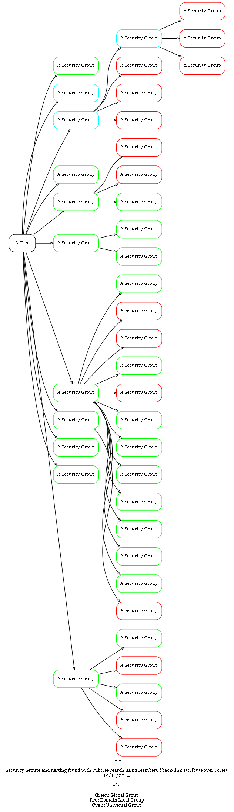

I'm amazed that I haven't previously had a need for something like this, but I was looking for some way to visualise AD group memberships, specifically to take into account fairly deeply nested groups. After a fair bit of searching, a lot of dead-ends and some products that seriously over-sold themselves, I came across this little beauty:

~~[https://gallery.technet.microsoft.com/scriptcenter/Graph-Nested-AD-Security-eaa01644](https://gallery.technet.microsoft.com/scriptcenter/Graph-Nested-AD-Security-eaa01644)~~

As the original download no longer seems to exist I've put a copy [here](draw-adsecuritygroupnesting.zip)

It's a Powershell module which extracts group memberships for a User, Group or OU (well, everything in that OU anyway) and creates a [Graphviz][1] file that gives a functional, if not very pretty, visualisation of the group membership hierarchy. The output looks something like this:

Extremely handy if you're trying to get a better idea of how your group nesting shakes out or where you may have circular memberships or redundant groups.

 [1]: http://www.graphviz.org
