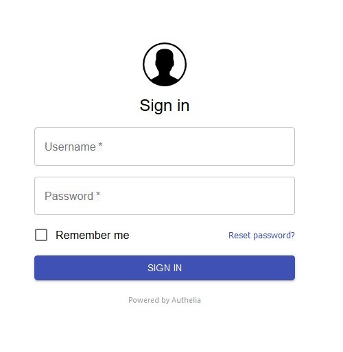
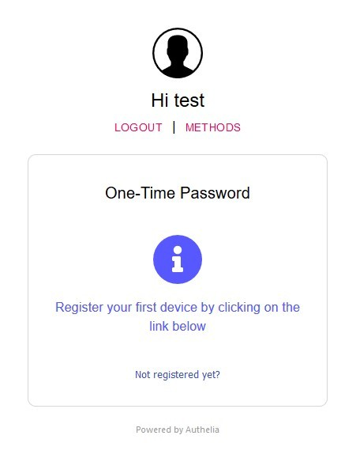

### Introduction

Authelia is an open-source authentication and authorization server providing 2-factor authentication and single sign-on (SSO) for your applications via a web portal. It's ideal if you want to make your self-hosted services accessible from the internet without letting every man and their dog nose through your stuff.

If you haven't got Traefik up and running yet, my guide to [setting it up as a reverse proxy for Docker](https://www.spad.uk/posts/practical-configuration-of-traefik-as-a-reverse-proxy-for-docker-updated-for-2023/) will help you out. If you've already got a working Traefik setup you might want to just skim it anyway for some additional context.

Note: Authelia can only protect a single domain (with sub-domains) at a time. You can't protect both example.com and example.net without running a second instance.

### Configuration

We're going to be using Docker Compose to spin up Authelia, as you would expect. I've bundled it into the same compose as Traefik but it's not mandatory.

```yaml
version: '2.4'

services:
  traefik:
  ...
  authelia:
    image: authelia/authelia:4
    container_name: authelia
    environment:
      - TZ=Europe/London
    volumes:
      - ./authelia:/config
      - ./authelia/secrets:/config/secrets:ro
    restart: unless-stopped
    networks:
      - proxy
    environment:
      - AUTHELIA_JWT_SECRET_FILE=/config/secrets/jwt
      - AUTHELIA_SESSION_SECRET_FILE=/config/secrets/session
      - AUTHELIA_NOTIFIER_SMTP_PASSWORD_FILE=/config/secrets/email
    labels:
      - traefik.enable=true
      - traefik.http.routers.authelia-https.rule=Host(`login.example.com`)
      - traefik.http.routers.authelia-https.entrypoints=https
      - traefik.http.routers.authelia-https.tls=true
      - traefik.http.routers.authelia-https.service=authelia-svc
      - traefik.http.services.authelia-svc.loadbalancer.server.port=9091
```

Let's zoom in on the environment variables first. Authelia does not support setting secrets directly via environment variables. You can put them into the `configuration.yml` but if you want to protect them a little better you can either user [Docker Secrets](https://docs.docker.com/engine/swarm/secrets/), which requires you to be using [Swarm Mode](https://docs.docker.com/engine/swarm/) or you can provide them via files, which is what I'm doing here. The files contain the secrets in plaintext, are owned by root and chmod'd to 600 so nobody else can read them. I've then mapped them into the container at `/config/secrets` and referenced them via the environment variables. Here's a [full list](https://www.authelia.com/docs/configuration/secrets.html) of available variables.

The Traefik labels are the same you'd expect to find on any other container, note that we're using `login.example.com` as the hostname.

#### Authelia

Authelia looks for a `configuration.yml` file in the root of the `/config` directory. We'll build it in stages.

```yaml
host: 0.0.0.0
port: 9091
log_level: info
#jwt_secret:
default_redirection_url: https://example.com
```

These are your basics, listen IP, listen port, log level, a secret for your JSON web tokens and the default redirection URL (where you'll go if you just login directly to Authelia rather than being redirected there from another site). If you're specifying the jwt_secret externally you can leave this out, otherwise generate a long random string and put it here. I went with a 64-characer alphanumeric string but YMMV.

```yaml
### TOTP Settings
totp:
  issuer: example.com
  period: 30
  skew: 1
### DUO Settings
#duo_api:
#  hostname: api-somenumber.duosecurity.com
#  integration_key: SOMESECRETKEY
#  secret_key: somelongersecretkey
```

Here we have a couple of options for our 2FA; TOTP (Google Authenticator, Authy, etc.) or [Duo](https://duo.com/). Authelia will also work with U2F hardware keys like Yubikey. In this case I'm going to use TOTP but there's nothing to stop you setting up both. It's not recommended to increase the code validity `period` or the `skew` (how many codes either side of the current one are still considered valid) although if you want to be extra safe you can set the `skew` to `0`.

```yaml
authentication_backend:
  disable_reset_password: false
  file:
    path: /config/users_database.yml
    password:
      algorithm: argon2id
      iterations: 1
      key_length: 32
      salt_length: 16
      memory: 512
      parallelism: 8
```

Authelia supports both file and LDAP-based authentication backends, we're going to use a file backend here for simplicity. Again these are the default values and it's not recommended to change them unless you understand what you're doing.

```yaml
access_control:
  default_policy: deny
  rules:
    - domain:
      - example.com
      - "*.example.com"
      policy: bypass
      networks:
        - 192.168.0.0/16
        - 172.16.0.0/12
        - 10.0.0.0/8
    - domain:
      - example.com
      - "*.example.com"
      policy: two_factor
 ```

 The `access_control` section allows you to define rules as to how Authelia handles authentication. There are four policies available: `bypass`,`one_factor`,`two_factor`, and `deny`. Bypass doesn't require any authentication, One Factor is just your password, Two Factor obviously requires a second factor, and deny prohibits any access. Policies are evaluted in order.

In our example config we've set all sites under example.com to require two factor authentication *unless* they are coming from an RFC1918 IP range (i.e. they are internal) in which case allow them without requiring any authentication. If none of the rules are matched for some reason, we've set the `default_policy` to deny for safety.

 ```yaml
session:
  name: authelia_session
#  secret:
  expiration: 1h
  inactivity: 5m
  remember_me_duration: 1M
  domain: example.com
regulation:
  max_retries: 3
  find_time: 2m
  ban_time: 5m
```

Similar to the jwt secret the session secret can be left out if you're supplying it externally. You can adjust the session timeouts if you like but the defaults are reasonable. The `remember_me_duration` is 1 month, in case you're wondering. You can also configure limits to help prevent brute-force attacks.

```yaml
storage:
  local:
    path: /config/db.sqlite3
notifier:
  disable_startup_check: false
  smtp:
    username: me@example.com
#    password:
    host: smtp.gmail.com
    port: 587
    sender: authelia@example.com
    subject: "[Authelia] {title}"
    startup_check_address: test@authelia.com
    disable_require_tls: false
    disable_html_emails: false
    tls:
      skip_verify: false
```

This is a small implementation so we're fine with SQLite for our database, but you can opt for MySQL, MariaDB, or PostgreSQL if you want something more robust.

Finally we need to configure a notifier to send people 2FA registration links. If you really don't have the option of SMTP then you can use a [filesystem provider](https://www.authelia.com/docs/configuration/notifier/filesystem.html) but it's not really suitable for production use. Again, if you're providing the password externally you don't need to do it here as well.

And that's our Authelia config.

#### Users

As I mentioned ealier we're using a file backend for user auth, so we need to create one; a `users_database.yml` in our `/config` directory. Inside you need to define your users.

```yaml
users:
  spad:
    displayname: "spad"
    password: "$argon2id$v=19$m=524288,t=1,p=longrandompasswordhashgenerated"
    email: spad@eaxmple.com
    groups: []
```

You can specify groups if you want to do group-based authentication but for now we'll keep it simple. The simplest way to generate your password hash is to run `docker run --rm authelia/authelia:latest authelia hash-password <yourpassword>`. If you've changed the default password settings in the configuration you'll need to read the [full CLI reference](https://www.authelia.com/docs/configuration/authentication/file.html#passwords) and adjust the command appropriately to match.

### Protecting Containers

To enable Authelia for your containers we first need to configure Traefik to forward the authentication to it. Add the following labels to your Traefik compose.

```yaml
      - traefik.http.middlewares.authelia.forwardauth.address=http://authelia:9091/api/verify?rd=https://login.example.com/
      - traefik.http.middlewares.authelia.forwardauth.trustforwardheader=true
      - traefik.http.middlewares.authelia.forwardauth.authresponseheaders=Remote-User, Remote-Groups
```

Here we define an `authelia` middleware telling Treafik to forward authentication requests to our Authelia container `http://authelia:9091` with a redirect URL of the external `https://login.example.com/` address. `trustforwardheader` means it will trust any existing `X-Forwarded-*` headers it recieves and `authresponseheaders` are the headers it will pass back.

### Testing

Fire up your browser, navigate to `https://login.example.com` and you should be presented with an Authelia login page:

[](Authelia1.jpg)

Login with the credentials you added to the `user_database.yml` and you'll be presented with another screen:

[](Authelia2.jpg)

If you click on the "Not registered yet?" link it will send an email with a registration link to the address configured for that user. Following the link will allow you to setup your TOTP app.

If you want to use a security key instead (or Duo, if you enabled it), click the "Methods" link and select it from the options listed.

After everything is setup correctly, after you authenticate you should get redirected to whichever URL you set as the `default_redirection_url` in your config.

#### Go Live

Now you know it's all working, you can enable Authelia for any of your containers by adding the following label (make sure you substitute in the correct router name). If you're doing an http->https redirect make sure you add the middleware to both routers.

```yaml
     - traefik.http.routers.mysite-https.middlewares=authelia
```

If you've already got middlewares in place, just add authelia to the end, comma separated.

```yaml
     - traefik.http.routers.mysite-http.middlewares=https-redirect,authelia
```

Don't forget that if you're using a file provider for any Traefik routers you'll need to specify the `@docker` namespace for the middleware.

```yaml
            middlewares:
              - authelia@docker
```

### Further Configuration

#### Groups

If you want to limit access to particular users or groups you can define additional rules in the `configuration.yml`.

```yaml
    - domain: "private.example.com"
      subject:
        - "user:dave"
        - "group:admins"
      policy: two_factor
```

If you're using the file user backend then groups are defined like so:

```yaml
users:
  spad:
    displayname: "spad"
    password: "$argon2id$v=19$m=524288,t=1,p=longrandompasswordhashgenerated"
    email: spad@example.com
    groups:
      - Admins
      - Devs
```

#### Other User Backends

If you want to use an LDAP user backend, such as OpenLDAP or Active Directory, the configuration details are [here](https://www.authelia.com/docs/configuration/authentication/ldap.html).

#### Other Storage Backends

Similarly if you want to use a "proper" database for your storage backend, the configuration details are [here](https://www.authelia.com/docs/configuration/storage/).

### Conclusions

Authelia is actually really simple to setup with Traefik; 3 labels to configure the integration and 1 for enabling it are all you really need. The bulk of the effort is configuring Authelia itself and hopefully you haven't found that too taxing either.

There are a few limitations/weaknesses of the platform, such as only supporting a single U2F security key per user, and there's no apparent way to stop someone who discovers your password from attempting to register a new 2FA device, although it would require them to have also compromised your email so it's an edge case *but don't reuse your passwords*.
