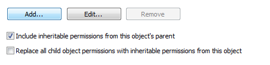

The following is the Powershell equivalent of unticking the box below for the folder "C:\temp":

[](Capture.png)

```powershell
$acl = get-acl "C:\temp"
$acl.SetAccessRuleProtection($true,$true)
$acl | set-acl
```

Note that SetAccessRuleProtection takes two boolean arguments; the first turns inheritance on ($False) or off ($True) and the second determines whether the previously inherited permissions are retained ($True) or removed ($False).
