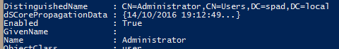
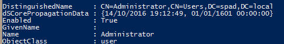

You know how annoying it is when you return some information in Powershell that includes a list of items and the console helpfully truncates it with a ...

Whereas what you really want is for it to just show the whole thing like:

Well you can. The truncation is controlled by `$FormatEnumerationLimit` and if you set it to `-1` it won't truncate output at all. The default for a standard Powershell instance is `4`, the Exchange Management Shell ups this to `16` and other console files may make their own modifications.

Simple.
