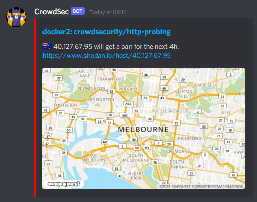

### Update To The Update

The issue with upstream proxies and the Traefik bouncer has been resolved by the maintainer. I'll leave my fork up in case I get some more free time to work on it.

~~I got impatient waiting for the bug with the Traefik bouncer to get fixed so I [forked it and fixed it myself](https://github.com/thespad/traefik-crowdsec-bouncer), as well as added a couple of extra features. I'm a Go n00b so don't expect rapid development but it works properly with Cloudflare et al.~~

The issue with bind mounts and the Crowdsec container has been resolved. Version 1.3.1 or later should correctly copy the necessary config files on first run.

~~I also found a bug with the CrowdSec container where if you use bind mounts rather than named volumes it doesn't properly copy the config files to the host. I've [PR'd a  fix](https://github.com/crowdsecurity/crowdsec/pull/1216) and it's been merged but there's not been a new image release yet to include it. In the meantime either use named volumes or `docker cp` the files out of the container into the bind mount folder before you start it up for the first time.~~

### Update

After chatting with one of the guys from CrowdSec I've updated this post - turns out you *can* do string manipulation, they're just using a different library to the one I was expecting to be there.

Also I fixed the Discord embed colours - turns out they're int not hex. Oops.

~~Also also, I've found a [bug](https://github.com/fbonalair/traefik-crowdsec-bouncer/issues/10) with the Traefik bouncer where it doesn't process X-Forwarded-For headers correctly so if you've got an upstream proxy like Cloudflare it won't apply the bans as expected.~~

### Introduction

[CrowdSec](https://crowdsec.net) is a free, open-source and collaborative IPS; it's like Fail2Ban but you share your bans with all of the other users to try and preemptively block malicious hosts.

As is something of a habit with me, I decided to try out a product only to realise it has gaps in documentation - in this instance lacking a lot of information around the docker implementation. Hopefully this post will make things easier for you than they were for me.

### Getting Started

You can install CrowdSec natively on your host but that's not very on-brand so let's start with a simple compose. Mine is going to cover Traefik and sshd:
```yml
services:
  crowdsec:
    image: docker.io/crowdsecurity/crowdsec:latest
    container_name: crowdsec
    environment:
      - GID=1000
      - COLLECTIONS=crowdsecurity/traefik crowdsecurity/http-cve crowdsecurity/whitelist-good-actors
      - CUSTOM_HOSTNAME=myserver
    volumes:
      - config:/etc/crowdsec
      - db:/var/lib/crowdsec/data/
      - /var/lib/docker/volumes/ssh/_data/logs/openssh/:/var/log/opensshd/:ro
      - /var/lib/docker/volumes/traefik/_data/logs/:/var/log/traefik/:ro
    networks:
      - proxy
    restart: unless-stopped
    security_opt:
      - no-new-privileges=true

networks:
  proxy:
    external: true

volumes:
  config:
  db:
```
Nothing out of the ordinary, I'm using docker volumes but you can use bind mounts if you prefer. Make sure the GID has permissions to read all the logs you want to mount, and mount them all into `/var/log/<some folder>`.

The `CUSTOM_HOSTNAME` env will make it simpler to identify your server if you have more than one. The `COLLECTIONS` env allows us to pre-install collections from the CrowdSec Hub. Collections are bundles of parsers and scenarios that make it easy to set things up for popular services. By default the container ships with the Linux collection which handles syslog and ssh logs and we're going to add the traefik collection, the http-cve collection, which covers a bunch of currently active CVEs, and the whitelist-good-actors collection which mostly covers CDNs like Cloudflare to make sure you don't accidentally block them and cut yourself off from large swathes of the internet.

Spin up the container and it should create all the basics for you.

Go find `acquis.yml` in your `config` mount and edit it. Here you need to label your logs so CrowdSec knows what it's looking at. Something like:
```shell
filenames:
  - /var/log/opensshd/*
labels:
  type: sshd
---
filenames:
  - /var/log/traefik/*
labels:
  type: traefik
```
Restart the container afterwards to have it pick up the new config, or you can run `docker exec crowdsec kill -SIGHUP 1` to have it reload the config without a restart.

The basic interface to everything in the container is their cscli tool, which you'll see if you run `docker exec -t crowdsec cscli scenarios list` or `docker exec -t crowdsec cscli parsers list` or, indeed, `docker exec -t crowdsec cscli collections list`

To make life easier working with cscli inside a container we're going to create an alias in our shell profile:

```bash
alias cscli="docker exec -t crowdsec cscli"
```

> ##### Side Note On Updates
> While updating the container will update the core CrowdSec application, it won't update the Parsers/Scenarios/etc. To do that you need to periodically run `cscli hub update` and then `cscli hub upgrade`. As far as I can tell so far, there's no way to have this run automatically.

At this point CrowdSec should be reading your logs and processing them, you can have a look at what's going on with 2 separate commands. `cscli metrics` will give you summary details on everything that CrowdSec is doing, and `cscli decisions list` will show you any bans that have been created.

The most important bit of the metrics output initially is the Acquisition Metrics which will hopefully look something like:
```shell
time="11-01-2022 10:10:26 AM" level=info msg="Acquisition Metrics:"
+----------------------------------+------------+--------------+----------------+------------------------+
|              SOURCE              | LINES READ | LINES PARSED | LINES UNPARSED | LINES POURED TO BUCKET |
+----------------------------------+------------+--------------+----------------+------------------------+
| file:/var/log/opensshd/current   |        805 |           89 |            716 |                    249 |
| file:/var/log/traefik/access.log |      42941 |        42937 |              4 |                   8665 |
+----------------------------------+------------+--------------+----------------+------------------------+
```
If you don't see it at all, it means no logs have been parsed from any source and you may need to check the container logs to see if anything stands out. If you're seeing logs being parsed, buckets filling, and decisions being made, then everything is working as intended.

### If Your Name's Not Down

OK, so CrowdSec is reading your logs and adding suspect IPs to its ban list. Cool. But that's not actually *doing* anything to stop them connecting at this point. CrowdSec uses Bouncers to do this. There are lots of them. There's a [Firewall Bouncer](https://hub.crowdsec.net/author/crowdsecurity/bouncers/cs-firewall-bouncer) for iptables/nftables, there's a [Cloudflare Bouncer](https://hub.crowdsec.net/author/crowdsecurity/bouncers/cs-cloudflare-bouncer) for the Cloudflare Firewall, and there's a [Traefik Bouncer](https://hub.crowdsec.net/author/fbonalair/bouncers/traefik-crowdsec-bouncer) which is what we're interested in right now.

So, let's add the bouncer to our compose:
```yml
  bouncer-traefik:
    image: docker.io/fbonalair/traefik-crowdsec-bouncer:latest
    container_name: crowdsec-bouncer-traefik
    environment:
      CROWDSEC_BOUNCER_API_KEY: ${TRAEFIK_BOUNCER_KEY}
      CROWDSEC_AGENT_HOST: crowdsec:8080
    networks:
      - proxy
    depends_on:
      - crowdsec
    restart: unless-stopped
```
This needs to be on a common network with both your CrowdSec container and your Traefik container.

Register the bouncer with CrowdSec to get an API key with `cscli bouncers add bouncer-traefik`and add the key to your bouncer container compose/.env file - don't lose it as you can't get it again without deleting and re-adding the bouncer.

Now you can do the blocking per-container but we're going to take the nuclear option and apply it across the board because we don't want any of these suspect users hitting our services.

Create a new yml file (or add to an existing one) where ever you keep your dynamic configs and define a new middleware:
```yml
http:
  middlewares:
    middleware-crowdsec-bouncer:
      forwardauth:
        address: http://crowdsec-bouncer-traefik:8080/api/v1/forwardAuth
        trustForwardHeader: true
```
And then in your *static* config, add the middleware to your entryPoints
```yml
entryPoints:
  http:
    address: ":80"
    http:
      middlewares:
        - middleware-crowdsec-bouncer@file

  https:
    address: ":443"
    http:
      middlewares:
        - middleware-crowdsec-bouncer@file
      tls: {}
```
Restart Traefik and now any inbound request will get sent to the Bouncer to check if it's on the banlist or not. Anything naughty gets a 403 and told to go away.

### Alerting

Now we've got our detection and blocking in place there's one more thing to do and that's alerting. CrowdSec offers a few alerting configs out of the box but Discord isn't one of them. You *can* just use the Slack notification and append `/slack` to the end of your Discord webhook but it doesn't look very pretty. If you want a "proper" Discord notifier you need to work for it.

Head to your CrowdSec config directory and create a `discord.yaml` in the `notifications` subdirectory. This will define your notification template and should look something like this:
```yaml
type: http

name: discord

log_level: info

format: |
  {
    "content": null,
    "embeds": [
      {{range . -}}
      {{$alert := . -}}
      {{range .Decisions -}}
      {{if $alert.Source.Cn -}}
      {
        "title": "{{$alert.MachineID}}: {{.Scenario}}",
        "description": ":flag_{{ $alert.Source.Cn | lower }}: {{$alert.Source.IP}} will get a {{.Type}} for the next {{.Duration}}. <https://www.shodan.io/host/{{$alert.Source.IP}}>",
        "url": "https://db-ip.com/{{$alert.Source.IP}}",
        "color": "16711680",
        "image": {
          "url": "https://www.mapquestapi.com/staticmap/v5/map?center={{$alert.Source.Latitude}},{{$alert.Source.Longitude}}&size=500,300&key=<MAPQUEST_API_KEY>"
        }
      }
      {{end}}
      {{if not $alert.Source.Cn -}}
      {
        "title": "{{$alert.MachineID}}: {{.Scenario}}",
        "description": ":pirate_flag: {{$alert.Source.IP}} will get a {{.Type}} for the next {{.Duration}}. <https://www.shodan.io/host/{{$alert.Source.IP}}>",
        "url": "https://db-ip.com/{{$alert.Source.IP}}",
        "color": "16711680"
      }
      {{end}}
      {{end -}}
      {{end -}}
    ]
  }

url: https://discord.com/api/webhooks/<DISCORD_WEBHOOK_KEY>

method: POST

headers:
  Content-Type: application/json
```
The alerts use Go templating which can be a bit of a steep learning curve if you're not used to it, though they do helpfully [document their Alert model](https://pkg.go.dev/github.com/crowdsecurity/crowdsec@master/pkg/models#Alert) to help you out.

This will create a Discord embed message with details of the IP that's been banned, a link to the db-ip.com page for the IP, a link to the Shodan page on the IP and an image from MapQuest showing you where in the world your malicious actor is. If you want to use the MapQuest integration you need to [register](https://developer.mapquest.com/documentation/) for an API key and add it to the config; they give you 15k free hits a month which should be enough most of the time.

Once the template is saved, open up profiles.yaml in your CrowdSec config directory, uncomment notifications: and underneath it add - discord so that it looks like this:

```yaml
name: default_ip_remediation
filters:
 - Alert.Remediation == true && Alert.GetScope() == "Ip"
decisions:
 - type: ban
   duration: 4h
notifications:
 - discord
 ```

If all goes to plan you should start getting Discord notifications a bit like this:



CrowdSec do also offer a [Metabase Dashboard](https://doc.crowdsec.net/docs/observability/dashboard) for keeping track of what it's up to. Personally I wouldn't bother as it uses an absurd amount of CPU and RAM to show you some pretty graphs. If you really want pretties there's a [Prometheus](https://doc.crowdsec.net/docs/observability/prometheus) endpoint you can use to grab data and throw it at a Grafana Dashboard. They even [provide some](https://github.com/crowdsecurity/grafana-dashboards) though they're not great, I'll be honest.

CrowdSec also have a hosted dashboard offering that's currently in beta, you can register for it at [https://app.crowdsec.net](https://app.crowdsec.net). It's definitely a good option if you're not allergic to The Cloud.

### Conclusion
CrowdSec is an interesting product. It positions itself as a straight upgrade to fail2ban, giving you collaborative, community blocking of malicious hosts without having to write a load of regex. The downside though is its multi-part nature with collectors and bouncers and alerting plugins makes it considerably more complex to set up the way you want to get a similarly functional product.

~~For now I'm taking a hybrid approach, using Fail2Ban for failed auth blocking at a host level and then running CrowdSec against Traefik to watch for more specific exploit attempts against things like Wordpress or popular vulnerabilities like log4j. Whether I stick with it, or move to it entirely, remains to be seen.~~

I've now swapped out fail2ban for CrowdSec entirely, using a combination of the iptables and Cloudflare bouncers with the intent of adding agents to other host for better visibility across my network.
