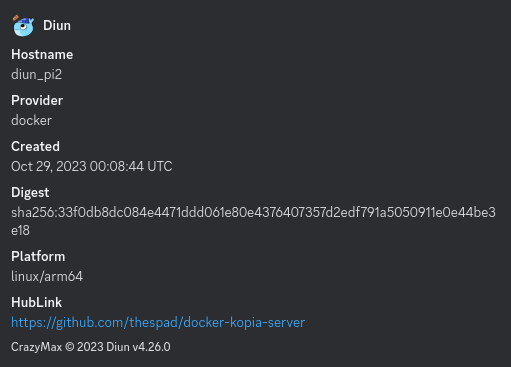

### Introduction
One of the most common questions around Docker is "how do I know when a new version of an image gets published?". Even if you're tied to a specific version tag, rather than `latest`, security and bug fixes can still result in new images being pushed and there's no built-in mechanism to notify you that it's happened.

There are a few automated update tools available; [Watchtower](https://registry.hub.docker.com/r/containrrr/watchtower/) and [Ouroboros](https://hub.docker.com/r/pyouroboros/ouroboros/) being the most common, but they're primarily designed to handle the whole process from update check, to download, to container recreation, and that's...risky. There might be stuff that you want to always be on the bleeding edge, but most of the time you'd prefer to wait a bit and make sure there's nothing that's going to cripple your containers before you pull the trigger. This is where [Diun](https://registry.hub.docker.com/r/crazymax/diun) comes in; a Docker Image Update Notifier, it does what it says on the tin. Diun can monitor your containers and send alerts when a new image is published; you can even have it monitor additional image tags that you're not currently using but want to keep track of.

### Using Diun
Let's go over a quick Compose example and see what we're dealing with
```yaml
version: "2.4"

services:
  diun:
    image: ghcr.io/crazymax/diun:latest
    container_name: diun
    hostname: diun_dockerhost1
    volumes:
      - ./data:/data
      - /var/run/docker.sock:/var/run/docker.sock:ro
    environment:
      - TZ=Europe/London
      - LOG_LEVEL=info
      - DIUN_DB_PATH=/data/diun.db
      - DIUN_WATCH_WORKERS=10
      - DIUN_WATCH_SCHEDULE=0 * * * *
      - DIUN_WATCH_FIRSTCHECKNOTIF=false
      - DIUN_PROVIDERS_DOCKER_WATCHBYDEFAULT=false
      - DIUN_NOTIF_TELEGRAM_TOKEN=${TGRAMAPI}
      - DIUN_NOTIF_TELEGRAM_CHATIDS=${TGRAMCHAT}
    restart: unless-stopped
    labels:
     - diun.enable=true
```
There are a couple of things to note here, first of all Diun needs access to your Docker socket to be able to enumerate the other containers. As the container is not exposed externally this is a low risk, but if you're really concered take a look at a socket proxy [like this](https://hub.docker.com/r/tecnativa/docker-socket-proxy) and use the `DIUN_PROVIDERS_DOCKER_ENDPOINT` environment variable to set the endpoint location.

Secondly, you'll notice that I've set the container `hostname`. This isn't mandatory but if you've got more than one box with Diun on you'll probably struggle to work out which is sending you notifications if you're relying on randomly generated hostnames.
#### Configuration
Diun can be configured via YAML config file or environment variables, here I'm using the latter.
```yaml
      - DIUN_DB_PATH=/data/diun.db
      - DIUN_WATCH_WORKERS=10
      - DIUN_WATCH_SCHEDULE=0 * * * *
      - DIUN_WATCH_FIRSTCHECKNOTIF=false
```
There shouldn't be any reason to move the database path or change the name, but you can. Equally you probably don't need to change the number of parallel workers unless you have a ton of containers or a rate-limited registry. The default schedule is hourly, which is broadly fine, but with Dockerhub's impending pull limits I've moved mine to 6-hourly (`0 */6 * * *`) - how often are new images being released anyway? If like me you're hopeless at cron syntax then [this site](https://crontab.guru/examples.html) is extremely useful. Finally Diun can send you a notification every time it starts monitoring a new image, but that can get noisy fast. May be helpful if multiple people are managing your environment and you want to keep track of what's been added.

If you don't include these variables they'll use their default values, as above.
```yaml
      - DIUN_PROVIDERS_DOCKER_WATCHBYDEFAULT=false
```
Each provider (docker, file, kubernetes, swarm) has its own provider options. In this case we don't want Diun to watch every container by default, only those we tell it to. This is achieved using labels, which we'll get to.
```yaml
      - DIUN_NOTIF_TELEGRAM_TOKEN=${TGRAMAPI}
      - DIUN_NOTIF_TELEGRAM_CHATIDS=${TGRAMCHAT}
```
There are a [bunch](https://crazymax.dev/diun/config/notif/) of different notification providers supported by Diun, in this case I'm using Telegram (and an `.env` file to store the API details). You can configure multiple notification providers if you need to.

Here's an example notification via Discord:

#### Monitoring Containers
Assuming you haven't set Diun to `WATCHBYDEFAULT` then you'll need to add labels to your containers to tell it to monitor them.
```yaml
    labels:
     - diun.enable=true
```
It's that simple. Diun will now check for new versions of that container's image every time it runs a check cycle. Note that currently it only notifies you once per version; it won't keep reminding you if you forget to update.
#### Registry Options
If you're using a private registry, or pulling images from somewhere like Dockerhub that need authentication, you can specify [regopts](https://crazymax.dev/diun/config/regopts/) for each one. For example
```yaml
      - DIUN_REGOPTS_0_NAME=docker.io
      - DIUN_REGOPTS_0_SELECTOR=image
      - DIUN_REGOPTS_0_USERNAME=${DOCKERIO_USERNAME}
      - DIUN_REGOPTS_0_PASSWORD=${DOCKERIO_PASSWORD}
      - DIUN_REGOPTS_1_NAME=ghcr.io
      - DIUN_REGOPTS_1_SELECTOR=name
      - DIUN_REGOPTS_1_USERNAME=${GHCRIO_USERNAME}
      - DIUN_REGOPTS_1_PASSWORD=${GHCRIO_PASSWORD}
```
Each set of regopts needs a numeric "key" to link them, you don't have to start at 0, but it's good practice. The registry `name` is self-explanatory. The `selector` is how Diun determines whether it should use the regopts, matching on either the name or the image. In the case of Dockerhub we don't typically use the name when referencing the image so we'll use the `image` selector. If you're using a different registry, like ghcr.io, you'll probably want to default to `name`. Hopefully you don't need the username and password explaining.
#### Advanced Monitoring
Let's say I'm using a fixed version tag for a container like `grafana/loki:1.6.0`, because they love making breaking chages, but I want to know when a new version gets pushed to the registry. Well I can use the `diun.watch_repo=true` label on a container to make Diun watch for *any* new images, not just the ones matching my current tag. This can be refined using the `diun.exclude_tags` label if you know there are tags you *don't* want to monitor. Alternatively, if you want to watch a specific set of tags, you can use the `diun.include_tags` label to do just that. Note that if you use `include_tags` you have to specify the tag you're using *as well as* any extra tags you want to monitor.
### Conclusion
Diun is a fantastic tool for keeping you up to date with new image releases and it's really very easy to setup and maintain. It would be lovely if it could send you release notes as well, but as Dockerhub doesn't provide any mechanism for image owners to provide them, there's not a lot Diun can do about it.
