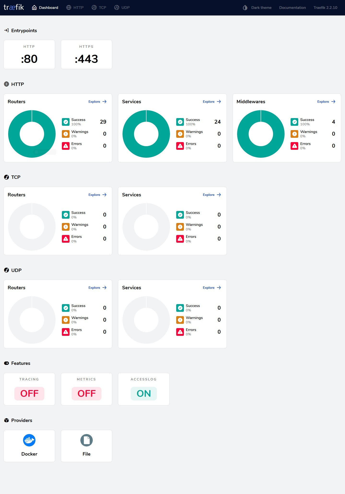

### Introduction

I originally wrote my [guide](https://www.spad.uk/practical-configuration-of-traefik-as-a-reverse-proxy-for-docker/) to configuring Traefik with Docker because there was very little documentation available online that I felt actually explained *why* you were doing anything it told you do, and consequently most people I encountered who had setup Traefik didn't really know what they'd done or how it worked and couldn't adapt their setup if they came across anything novel. Since then I've had a lot more time to develop my Traefik setup and better understand some of its nuances, and honestly there's just some stuff I wrote that I've since realised just isn't the optimal approach.

So with that in mind, consider this a straightforward replacement to the original post.

### Configuration

We're going to be using [Docker Compose](https://docs.docker.com/compose/) to spin up our Traefik container and keep any sensitive values in an `.env` file. If you're not already using Compose to manage your containers, you're going to want to start.

If you've not used an `.env` file with Compose before it's very simple. Just create a file called `.env` in the same directory as your compose yml and in it put key/value pairs containing the information you want. Note that unlike with compose v1 (`docker-compose`), v2 (`docker compose`) requires you to escape certain characters such as `$` like you would if you put them directly into the compose yml. See the [official docs](https://docs.docker.com/compose/environment-variables/env-file/) for examples. You can then reference these variables in your compose file like so:

```bash
MYSECRET=password123
```

```yaml
    environment:
      DATABASE_PASSWORD=${MYSECRET}
```

With that out the way, here is our compose for Traefik.

```yaml
services:
  traefik:
    image: traefik:v2.10
    container_name: traefik
    restart: always
    networks:
      - proxy
    ports:
      - 80:80
      - 443:443
    volumes:
      - /etc/localtime:/etc/localtime:ro
      - /var/run/docker.sock:/var/run/docker.sock:ro
      - ./data/traefik.yml:/traefik.yml:ro
      - ./data/configs:/configs:ro
      - ./data/acme.json:/acme.json:rw
      - ./data/logs:/logs:rw
    environment:
      - CF_DNS_API_TOKEN=${CFAPI}
    read_only: true
    security_opt:
      - no-new-privileges=true
    labels:
      - traefik.enable=true
      - traefik.http.routers.traefik-https.entrypoints=https
      - traefik.http.routers.traefik-https.rule=Host(`myproxy.example.com`)
      - traefik.http.middlewares.traefik-auth.basicauth.users=${TRAEFIKADMIN}
      - traefik.http.routers.traefik-https.middlewares=traefik-auth
      - traefik.http.routers.traefik-https.service=api@internal
      - traefik.http.routers.traefik-https.tls.certresolver=letsencrypt
      - traefik.http.routers.traefik-https.tls.domains[0].main=example.com
      - traefik.http.routers.traefik-https.tls.domains[0].sans=*.example.com

networks:
  proxy:
    external: {}
```

 So let's break down what's going on here.

```yaml
services:
  traefik:
    image: traefik:v2.10
    container_name: traefik
    restart: always
    networks:
      - proxy
    ports:
      - 80:80
      - 443:443
```

First we create our container, give it a name, set it to always restart with the docker service, tell it to use the network called `proxy`, and to expose ports 80 and 443 for external connections.

Note that I'm using the `v2.10` tag here. Traefik doesn't offer major version tags so you can't pin to `v2` and using `latest` can be risky and lead to broken services, especially with 3.0 just around the corner. If you choose to pin, just make sure you keep up with releases and update as required, and conversely if you're going with `latest` keep up with releases and don't update blindly.

```yaml
    volumes:
      - /etc/localtime:/etc/localtime:ro
      - /var/run/docker.sock:/var/run/docker.sock:ro
      - ./data/traefik.yml:/traefik.yml:ro
      - ./data/configs:/configs:ro
      - ./data/acme.json:/acme.json:rw
      - ./data/logs:/logs:rw
```

Next, we configure the mapped volumes for the required files. Mapping `/etc/localtime` ensures that the container clock is in sync with the host. Now you could just map `./data:/` to keep things simple but I wanted to be able to specify Read-Only (RO) or Read-Write (RW) for each mount, hence the individual mappings. If you're doing it this way you'll need to pre-create the acme.json file and set its permissions correctly; something like:

```bash
touch acme.json
sudo chown root:root acme.json
sudo chmod 600 acme.json
```

| ⚠ | If you try and mount a file that doesn't exist on the host into a container, Docker will instead create a *folder* on the host with the same name, and then likely throw an error and fail to create the container. If this happens, delete the folder, create the file, then recreate the container.       |
|---------------|:------------------------|

Moving on.

```yaml
    environment:
      - CF_DNS_API_TOKEN=${CFAPI}
```

Here we use an environment variable to provide the container with our Cloudflare API key, as we're using a DNS challenge for our certificates. The list of supported providers and their corresponding environment variables is [here](https://doc.traefik.io/traefik/https/acme/#providers). If you're using an HTTP challenge then you can leave this bit out.

```yaml
    read_only: true
```

This option mounts the root filesystem of the container as read only and is a security measure that reduces the risk if somebody compromises the container because it prevents them from modifying anything that would survive a restart.

```yaml
    security_opt:
      - no-new-privileges=true
```

Another security-focused setting, this prevents processes from acquiring more privileges than they were started with, for example via sudo or suexec.

```yaml
networks:
  proxy:
    external: {}
```

We're going to want all of our proxied containers to share a common docker network. To keep things simple I've already created one (`docker network create proxy`) that I can then connect everything to and is independent of any compose project. When you reference an existing network in a compose file you need to tell Docker that it doesn't need to create it by defining it as `external: {}`.

We'll come back to the `labels` once we've finished setting everything up.

#### Traefik Itself

The Traefik application can be configured using one of several different config options but as we're working with v2 we're going to use YAML over the legacy TOML format. Almost everything we're about to configure *could* be done purely using Docker container labels and environment variables, but that's going to start getting messy and hard to keep track of very quickly so we'll keep the static stuff away from the containers. Let's build ourselves a Traefik config file.

Create your traefik.yml with the rest of the files in the data directory. This file can be owned by anyone as long as root has at least Read permissions on it.

 ```yaml
 api:
  dashboard: true
```

First up we enable the web Dashboard. This isn't mandatory but it makes it much easier to see that everything is being configured as you'd expect.

```yaml
entryPoints:
  http:
    address: ":80"
    forwardedHeaders:
      trustedIPs:
        - 127.0.0.1/32
        - 192.168.0.0/16
        - 172.16.0.0/12
        - 10.0.0.0/8
  https:
    address: ":443"
    http:
      tls: {}
    forwardedHeaders:
      trustedIPs:
        - 127.0.0.1/32
        - 192.168.0.0/16
        - 172.16.0.0/12
        - 10.0.0.0/8
```

Next we configure the entrypoints; these are the ports Traefik will listen on for incoming connections. The names (`http` and `https`) are arbitrary but you'll want to give them descriptive names to make sure you know which port each entrypoint covers. If you have any upstream devices that might insert themselves into the traffic flow (proxies, load balancers, etc.) and want to preserve the original source addresses, you can add trustedIPs to accept the `X-Forwarded-For` headers from.

```yaml
providers:
  docker:
    endpoint: "unix:///var/run/docker.sock"
    exposedByDefault: false
    defaultRule: "Host(`{{ index .Labels \"com.docker.compose.service\"}}.example.com`)"
    network: proxy
  file:
    directory: "/configs"
    watch: true
```

Traefik needs to know where your docker `endpoint` is to be able to read the container config. If you wish you can use `exposeByDefault: true` to make all containers available by default, but it's probably not a good idea. We also tell it to use the `proxy` network by default to reach backend containers (though this can be overridden per container) and we also set up a `defaultRule` for container hostnames. This bit is optional but I find it useful; what it means is that if you don't specify a hostname for a container, it will default to `<servicename>.example.com`. You could tweak this to generate whatever default naming scheme you prefer.

In addition we setup a `file` provider. This allows you to configure non-docker backends to proxy and setup additional configuration files for specific purposes. Setting the `watch` option to `true` means that Traefik will monitor the directory for changes and dynamically update its configuration, otherwise it requires a restart to do so.

```yaml
certificatesResolvers:
  http:
    acme:
      email: cert@example.com
      storage: acme.json
      httpChallenge:
        entryPoint: http
  letsencrypt:
    acme:
      email: cert@example.com
      storage: acme.json
      dnsChallenge:
        provider: cloudflare
        resolvers:
          - "1.1.1.1:53"
          - "1.0.0.1:53"
  zerossl:
    acme:
      caServer: https://acme.zerossl.com/v2/DV90
      email: cert@example.com
      storage: acme.json
      dnsChallenge:
        provider: cloudflare
        resolvers:
          - "1.1.1.1:53"
          - "1.0.0.1:53"
      eab:
        kid: sdjkflUHKer79HLK
        hmacEncoded: sjflkJLHeh5JHfdGUIGEJ8ASdyouhj43
```

Traefik supports configuring multiple different ACME challenge types, which can then be invoked per container. Here we configure both the HTTP and DNS challenge types. The `email` is required for the certificate issuer to be able to send you notifications for things like certificate expiry, so that if the automatic renewal process fails for some reason you'll know about it. `storage` points at the acme.json file we created earlier.

For the HTTP challenge, the `entryPoint` needs to be set to whatever you called your port 80 entrypoint at the top of the config. For the DNS challenge you'll need to specify a `provider`, as per [the list](https://doc.traefik.io/traefik/https/acme/#providers) and you can optionally specify DNS `resolvers` to use for looking up that provider, which can help avoid propagation delays.

For some providers like ZeroSSL, you also need to provide EAB (External Account Binding) credentials. These consist of a KID and HMAC token, which identify you to the server, and can usually be generated from the provider's website.

If you're testing things and don't want to risk falling foul of the LetsEncrypt rate limts you can use the `caServer` option for the challenge and set it to their Staging server URL, which is `https://acme-staging-v02.api.letsencrypt.org/directory`. Note that certificates issued from the staging server are not trusted by browsers. Also note that if you don't provide a value for `caServer` it will default to the LetsEncrypt Production endpoint.

```yaml
serversTransport:
    insecureSkipVerify: false
```

If some of your backends require SSL, such as Vaultwarden or the Unifi Controller for example, then you can tell Traefik to ignore the fact that their certificates are untrusted by setting `insecureSkipVerify` to `true`. This can be set per-container if preferred and I'll cover how to do that a bit later as it's not part of the static config.

```yaml
accessLog:
  filePath: "/logs/access.log"
  fields:
    headers:
      names:
        User-Agent: keep

log:
  filePath: "/logs/traefik.log"
  level: INFO
```

Finally we set up logging. Access logging is optional but frequently useful, here we also tell it to make sure it keeps the User-Agent field and you can see a complete list of available fields to keep, drop, or redact [here](https://doc.traefik.io/traefik/observability/access-logs/#limiting-the-fieldsincluding-headers).

We can also set the application log level to DEBUG if we're troubleshooting, or reduce it to WARNING or even ERROR if you feel it's too noisy.

All logs write to stdout by default but can be changed to write to file by adding the `filePath` entry as above. Personally I write the access log to stdout and the application log to file, but YMMV.

And here's the full config file

```yaml
api:
  dashboard: true

entryPoints:
  http:
    address: ":80"
    forwardedHeaders:
      trustedIPs:
        - 127.0.0.1/32
        - 192.168.0.0/16
        - 172.16.0.0/12
  https:
    address: ":443"
    http:
      tls: {}
    forwardedHeaders:
      trustedIPs:
        - 127.0.0.1/32
        - 192.168.0.0/16
        - 172.16.0.0/12

providers:
  docker:
    endpoint: "unix:///var/run/docker.sock"
    exposedByDefault: false
    defaultRule: "Host(`{{ index .Labels \"com.docker.compose.service\"}}.example.com`)"
    network: proxy
  file:
    directory: "/configs"
    watch: true

certificatesResolvers:
  http:
    acme:
      email: cert@example.com
      storage: acme.json
      httpChallenge:
        entryPoint: http
  letsencrypt:
    acme:
      email: cert@example.com
      storage: acme.json
      dnsChallenge:
        provider: cloudflare
        resolvers:
          - "1.1.1.1:53"
          - "1.0.0.1:53"
  zerossl:
    acme:
      caServer: https://acme.zerossl.com/v2/DV90
      email: cert@example.com
      storage: acme.json
      dnsChallenge:
        provider: cloudflare
        resolvers:
          - "1.1.1.1:53"
          - "1.0.0.1:53"
      eab:
        kid: sdjkflUHKer79HLK
        hmacEncoded: sjflkJLHeh5JHfdGUIGEJ8ASdyouhj43

serversTransport:
    insecureSkipVerify: false

accessLog:
  filePath: "/logs/access.log"
  fields:
    headers:
      names:
        User-Agent: keep

log:
  filePath: "/logs/traefik.log"
  level: INFO
```

#### TLS Options

TLS options regarding minimum versions and supported ciphers have to be set in a dynamic configuration file in the `/configs` directory. I'd suggest something simple like `tls.yml`.

```yaml
tls:
  options:
    default:
      minVersion: VersionTLS12
      cipherSuites:
       - "TLS_ECDHE_RSA_WITH_AES_128_GCM_SHA256"
       - "TLS_ECDHE_RSA_WITH_AES_256_GCM_SHA384"
       - "TLS_ECDHE_RSA_WITH_CHACHA20_POLY1305"
       - "TLS_ECDHE_ECDSA_WITH_AES_128_GCM_SHA256"
       - "TLS_ECDHE_ECDSA_WITH_AES_256_GCM_SHA384"
       - "TLS_ECDHE_ECDSA_WITH_CHACHA20_POLY1305"
```

If you know everything connecting is going to support TLS 1.3 then you can set the minVersion to `VersionTLS13` instead and ditch the cipher suite list. There's a good TLS best practices guide [here](https://github.com/ssllabs/research/wiki/SSL-and-TLS-Deployment-Best-Practices) if it's something you're not au fait with.

I mentioned earlier about setting certificate validation per-container. If you want to do that then you can do so by creating a named serversTransport in your TLS dynamic config file like so.

```yaml
http:
  serversTransports:
    securetransport:
      insecureSkipVerify: false
    insecuretransport:
      insecureSkipVerify: true
```

And then referencing it in your container label

```yaml
traefik.http.services.example-svc.loadBalancer.serversTransport=insescuretransport@file
```

#### Labels

OK, now back to our compose

```yaml
    labels:
      - traefik.enable=true
      - traefik.http.routers.traefik-https.entrypoints=https
      - traefik.http.routers.traefik-https.rule=Host(`myproxy.example.com`)
      - traefik.http.middlewares.traefik-auth.basicauth.users=${TRAEFIKADMIN}
      - traefik.http.routers.traefik-https.middlewares=traefik-auth
      - traefik.http.routers.traefik-https.service=api@internal
      - traefik.http.routers.traefik-https.tls.certresolver=letsencrypt
      - traefik.http.routers.traefik-https.tls.domains[0].main=example.com
      - traefik.http.routers.traefik-https.tls.domains[0].sans=*.example.com
```

Traefik uses these labels on each container to decide how to handle them, which rules to create, which ports to forward connections to, etc. so we'll go through them one at a time.

```yaml
      - traefik.enable=true
```

Nice and simple, this tells Traefik you want to expose this container and is necessary because we set `exposedByDefault: false` in the traefik config.

```yaml
      - traefik.http.routers.traefik-https.entrypoints=https
```

Traefik uses `routers` to direct traffic. This one we've called `traefik-https` and specified that it should listen only on the `https` entrypoint for incoming connections. All other labels related to this router need to have the same `traefik-https` name.

```yaml
      - traefik.http.routers.traefik-https.rule=Host(`myproxy.example.com`)
```

Remember the `defaultRule` setting in the traefik.yml? Well if you don't configure that, or you want to deviate from it, you can use the `rule` label to set the hostname you want to match for connections to this container. Here we want to use `myproxy.example.com` instead of the `defaultRule`'s `traefik.example.com`.

```yaml
      - traefik.http.middlewares.traefik-auth.basicauth.users=${TRAEFIKADMIN}
```

This label creates a [middleware](https://doc.traefik.io/traefik/middlewares/overview/) called `traefik-auth` which applies basic auth to a connection. The `${TRAEFIKADMIN}` value is pulled from the `.env` file and is generated using `htpasswd` like so

```bash
$ htpasswd -nbB user password
user:$2y$05$gQIjpyN8.FEvBdHCxxQ6.e3K5zlLOhGGSnOfqMm9MpMKEal96niQu
```

You can then add this string to your `.env`

```bash
TRAEFIKADMIN=user:$2y$05$gQIjpyN8.FEvBdHCxxQ6.e3K5zlLOhGGSnOfqMm9MpMKEal96niQu
```

You can also use a file if you have lots of users to add by instead using the `usersfile` label (and obviously mapping the file into your Traefik container).

```yaml
      - traefik.http.middlewares.traefik-auth.basicauth.usersfile: "/.htpasswd"
```

Note that defining middlewares doesn't put them into action, that comes later. In theory you can define a middleware on any container and reference it from any other, but in practice it's best to define any general-purpose ones on the Traefik container itself, or in a file, so that if you later down a container that's defining a critical middlware you don't break all your other containers.

```yaml
      - traefik.http.routers.traefik-https.middlewares=traefik-auth
```

Speaking of putting middlewares into action, here we list the middlewares we want to apply to the `traefik-https` router. In this case it's just the one but you can comma-separate multiple. By applying `traefik-auth` any connections to this router will get prompted for the username and password we generated earlier.

```yaml
      - traefik.http.routers.traefik-https.service=api@internal
```

This label sets the service we're connecting to, in this case it's a special built-in one, `api@internal` which is the dashboard. In a bit I'll show you an example of a "normal" service.

```yaml
      - traefik.http.routers.traefik-https.tls.certresolver=letsencrypt
```

And we want to get our certificate from LetsEncrypt using the DNS challenge options we configured in the traefik.yml.

You can also set a default certresolver in your traefik.yml static config file by replacing `tls: {}` in your https entrypoint with:

```yaml
      tls:
        certResolver: letsencrypt
```

Or whichever resolver you prefer. As usual this can be overridden per-container.

Now, if we just left it at that, Traefik would go off and fetch a certificate for `myproxy.example.com` and be done with it, but what if we want to get a wildcard cert for use on multiple containers?

```yaml
      - traefik.http.routers.traefik-https.tls.domains[0].main=example.com
      - traefik.http.routers.traefik-https.tls.domains[0].sans=*.example.com
```

Here we specify that instead of `myproxy.example.com` we want Traefik to request a cert for just `example.com` with a SAN list of `*.example.com`. Traefik is smart enough to reuse these certs for other containers that match so you only need these labels on the Traefik container itself. Note that you can't request a wildcard cert if you're using an HTTP challenge, it's only supported via DNS challenge.

If you need wildcards for more than one domain you can just add extra labels and increment the `domains` array number, e.g.:

```yaml
      - traefik.http.routers.traefik-https.tls.domains[0].main=example.com
      - traefik.http.routers.traefik-https.tls.domains[0].sans=*.example.com
      - traefik.http.routers.traefik-https.tls.domains[1].main=example.net
      - traefik.http.routers.traefik-https.tls.domains[1].sans=*.example.net
```

At this point you can spin up the Traefik container and you should be able to connect to the dashboard at `https://myproxy.example.com` using whichever password you set. Next we'll take a look at some actual container configs - remember that Traefik will dynamically process container labels when the container is created, so you don't need to touch Traefik itself, but you can watch it all unfold in realtime on the dashboard.

[](TraefikDash.jpg)

### Service Examples

#### Basic HTTP Container

Let's take a [Bookstack container](https://registry.hub.docker.com/r/linuxserver/bookstack) as an example of a basic HTTP container.

```yaml
    labels:
     - traefik.enable=true
     - traefik.http.routers.bookstack-https.rule=Host(`bookstack.example.com`)
     - traefik.http.routers.bookstack-https.entrypoints=https
     - traefik.http.routers.bookstack-https.service=bookstack
     - traefik.http.services.bookstack.loadbalancer.server.port=80
```

You'll see this is broadly the same as the Traefik container until we get to the router `service` definition.

```yaml
     - traefik.http.routers.bookstack-https.service=bookstack
```

Instead of `api@internal` we tell the router to use our custom service called `bookstack`.

```yaml
     - traefik.http.services.bookstack.loadbalancer.server.port=80
```

And then we define that service and make it a loadbalancer that will direct traffic to port 80. Note that this is the *internal* container port that the service is running on and not any custom port you may have mapped to the host.

##### Basic HTTPS Container

OK, so what about an HTTPS backend? Let's look at a [Unifi Controller container](https://registry.hub.docker.com/r/linuxserver/unifi-controller).

```yaml
    labels:
     - traefik.enable=true
     - traefik.http.routers.unifi-https.rule=Host(`unifi.example.com`)
     - traefik.http.routers.unifi-https.entrypoints=https
     - traefik.http.routers.unifi-https.service=unifi
     - traefik.http.services.unifi.loadbalancer.server.scheme=https
     - traefik.http.services.unifi.loadbalancer.server.port=8443
```

Again broadly similar to the previous example with one exception.

```yaml
     - traefik.http.services.unifi.loadbalancer.server.scheme=https
     - traefik.http.services.unifi.loadbalancer.server.port=8443
```

Here we tell Traefik that it needs to use HTTPS to connect to the container and that it should do so on port 8443.

##### Non-Docker Backend Service

And what about a non-docker backend? Well for that we need to create a config file in the `/configs` directory. These follow the same structure as the compose labels but in YAML format. Here we have config for a [Monit](https://mmonit.com/monit/) instance running on another machine.

```yaml
http:
  routers:
    monit-https:
      entryPoints:
        - "https"
      rule: Host(`monit.example.com`)
      service: "monit"

  services:
    monit:
      loadBalancer:
        servers:
          - url: "http://monit.example.local:2812/"
```

If it was an HTTPS backend we would just need to change the `url` to an HTTPS one. The URL doesn't have to be an FQDN (unless the backend is expecting one), it can be a hostname or IP address, as long as it points to the correct place.

##### Non-Wildcard Service

In the Traefik Compose file we requested a wildcard certificate for `*.example.com`. If you need to run a service not covered by that wildcard, you can simply add the `certresolver` label and Traefik will request a certificate for it at runtime based on the host rule.

```yaml
    labels:
     - traefik.enable=true
     - traefik.http.routers.bookstack-org-https.rule=Host(`bookstack.example.org`)
     - traefik.http.routers.bookstack-org-https.entrypoints=https
     - traefik.http.routers.bookstack-org-https.tls.certresolver=letsencrypt
     - traefik.http.routers.bookstack-org-https.service=bookstack-org
     - traefik.http.services.bookstack-org.loadbalancer.server.port=80
````

##### HTTP->HTTPS Redirect

If you want to be able to hit the HTTP address for your service and get automatically redirected to HTTPS then you need the help of some middlware. Let's look at our Bookstack container again.

```yaml
    labels:
     - traefik.enable=true
     - traefik.http.routers.bookstack-https.rule=Host(`bookstack.example.com`)
     - traefik.http.routers.bookstack-https.entrypoints=https
     - traefik.http.routers.bookstack-https.service=bookstack
     - traefik.http.services.bookstack.loadbalancer.server.port=80
```

And change it to.

```yaml
    labels:
     - traefik.enable=true
     - traefik.http.routers.bookstack-https.rule=Host(`bookstack.example.com`)
     - traefik.http.routers.bookstack-https.entrypoints=http,https
     - traefik.http.routers.bookstack-https.service=bookstack
     - traefik.http.middlewares.https-redirect.redirectscheme.scheme=https
     - traefik.http.routers.bookstack-https.middlewares=https-redirect
     - traefik.http.services.bookstack.loadbalancer.server.port=80
```

First we create the middleware to redirect traffic to `https`. Typically this middleware would be configured as a label on the Traefik container, or in a dynamic config file, to make it easier to reuse, but there's nothing stopping you from creating multiple `redirectscheme` middlewares across multiple containers if you prefer.

With our middleware in place we add the `http` entrypoint to the `entrypoints` list, then we configure our router to use the `https-redirect` middleware.

##### A quick warning note on entrypoints and certresolvers

You cannot use combined http/https entrypoints *and* a certresolver label at the same time, i.e.

```yaml
     - traefik.http.routers.bookstack-https.entrypoints=http,https
     - traefik.http.routers.bookstack-https.tls.certresolver=letsencrypt
```

Because the certresolver label will force TLS on the whole router, which will break the http entrypoint. You instead need to do

```yaml
     - traefik.http.routers.bookstack-http.entrypoints=http
     - traefik.http.routers.bookstack-https.entrypoints=https
     - traefik.http.routers.bookstack-https.tls.certresolver=letsencrypt
```

You can then point both routers at the same service. If you're not setting a `certresolver` label because you're using wildcard certs or using a default certresolver from your static config then you won't run into this issue.

##### IP-Based Whitelisting

Now, what if we want to limit access to some services to internal users, but allow external connections to others? For that we need an ipwhitelist middleware. This can be done via a label or a file, but I find a file easier to manage if you have lots of IP ranges you want to whitelist, and it also means you don't have to recreate the Traefik container to update the subnets. Again we create a .yml file in the `/configs` directory and put our middleware settings into it.

```yaml
http:
  middlewares:
    internal-ipwhitelist:
      ipWhiteList:
        sourceRange:
          - "127.0.0.1/32"
          - "192.168.0.0/24"
          - "172.16.0.0/12"
          - "10.0.0.0/8"
```

`internal-ipwhitelist` is the name you want to give to the middleware and then `sourceRange` is your list of subnets. We could now apply this list to our Traefik container with a label.

```yaml
      - traefik.http.routers.traefik-https.middlewares=traefik-auth,internal-ipwhitelist@file
```

Now any connection to `myproxy.example.com` from outside of the allowed ranges will be met with a 403 forbidden error. You can have multiple different whitelists if you need to, just give them different names.

### Shortcuts

#### Container Labels

Traefik offers you a number of shortcuts that can simplify your container labels at the cost of explicit control.

For example, instead of

```yaml
     - traefik.http.routers.bookstack-https.entrypoints=http,https
```

You can just omit the entire entrypoints label and Traefik will listen on *all* configured entrypoints. Fine if you've only got the two, can be an issue if you have more.

Similarly if instead of

```yaml
     - traefik.http.services.bookstack.loadbalancer.server.port=80
```

You omit the entire port label, Traefik will use the first port listed in the EXPOSE statement of the image. This can be tricky for obvious reasons as you reliant on the image provider setting it correctly at build time.

And finally, if instead of

```yaml
     - traefik.http.routers.bookstack-https.service=bookstack
```

You omit the entire service label, Traefik will look for a service that matches the name of the router.

So, in theory, instead of

```yaml
    labels:
     - traefik.enable=true
     - traefik.http.routers.bookstack-https.rule=Host(`bookstack.example.com`)
     - traefik.http.routers.bookstack-https.entrypoints=https
     - traefik.http.routers.bookstack-https.service=bookstack
     - traefik.http.services.bookstack.loadbalancer.server.port=80
```

You could instead use

```yaml
    labels:
     - traefik.enable=true
```

To the same effect - and in fact by enabling `exposedByDefault` you could remove all labels and have a zero-touch config, as long as you stick to a fairly simple setup and trust your image maintainers to be consistent. I wouldn't recommend going that far personally, but it's an option.

#### Middleware

Like a lot of settings, middleware can be configured at an entrypoint level in your static config to apply to all containers. For example, if you wanted to set the [X-Clacks-Overhead](https://xclacksoverhead.org/home/about) header for every service you publish, you could define it:

```yaml
http:
    middleware-pratchett:
      headers:
        customresponseheaders:
          X-Clacks-Overhead: GNU Terry Pratchett
```

And the add it to your entrypoints

```yaml
entryPoints:
  http:
    address: ":80"
    http:
      middlewares:
        - middleware-pratchett@file
```

Note that because middlewares are additive, it's non-trivial to remove a default middleware on a per-container basis.

### A Quick Note On Namespaces

Traefik has multiple different namespaces for configuration objects which you may have picked up on looking through this piece. The ones we care about for our purposes are `@internal`, `@docker`, and `@file`. If you're referencing something within the same namespace, say a Docker label-defined middleware from a Docker label-defined router, you don't need to specify the namespace. If, however, you're using things cross-namespace, such as with the IP Whitelist example above, you need to specify where you're getting it from.

This is why we use `traefik-auth` to refer to the basicauth middleware, because it's defined in a Docker label and called from a Docker label, but `internal-ipwhitelist@file` because it's defined in a file and called from a Docker label. Equally if you were doing things the other way around, you'd reference `internal-ipwhitelist@docker` in your .yml file. You can of course *always* specify the namespace, even when it's not technically necessary, if it makes it easier for you to keep track.

### Security Considerations

#### Files

If your container doesn't need to be able to write to files on the host, mount them as RO. The only things that Traefik needs to write to are logs, if you're writing any of them to file, and the `acme.json` file which stores the LetsEncrypt certificates.

##### Container

As I mentioned at the top, if there's no need for the container to write to its own root filesystem, spin it up with `read_only: true`. This stops anything from modifying the container filesystem while it's running and limits the risk of any kind of persistence for malicious actors.

##### Docker Socket

Traefik's Docker integration necessitates access to the Docker socket and this is a potential attack vector. Although we mount the socket as RO that doesn't actually mean that the container's access to the Docker API is read-only, it just stops it from modifying the socket itself. That means that in practice the Traefik container has full access to read and write to your Docker environment.

One mitigation option is to use a Socket Proxy such as [this one](https://github.com/linuxserver/docker-socket-proxy/) which lets you limit what Traefik can access. The only API component required for Traefik to operate is read-only access to `CONTAINERS` so you can otherwise lock things right down. Here's an example compose for the socket proxy.

```yaml
services:
  traefik-dockerproxy:
    image: lscr.io/linuxserver/socket-proxy:latest
    container_name: traefik-dockerproxy
    environment:
      - CONTAINERS=1
      - POST=0
    volumes:
      - /var/run/docker.sock:/var/run/docker.sock:ro
    tmpfs:
      - /run
    networks:
      - proxy
    restart: always
    security_opt:
      - no-new-privileges=true
    read_only: true

networks:
    proxy:
        external: true
```

You can then set the Docker endpoint in your traefik.yml to use the socket proxy and remove the Docker socket mount from your compose.

```yaml
providers:
  docker:
    endpoint: "tcp://dockerproxy-traefik:2375"
```

### HTTP/3

Traefik v2 has experimental support for HTTP/3. If you want to make use of it, you can enable it in your traefik.yml by adding the top level setting

```yaml
experimental:
  http3: true
```

And then under your https entrypoint

```yaml
entryPoints:
  https:
    http3:
      advertisedPort: 443
```

Note that HTTP/3 is *UDP* so make sure the necessary ports are open and forwarded on your LAN edge.

### Conclusions

With any luck you're now less confused about Traefik than when you started reading this.

I know there's a lot to absorb, and the initial investment of effort to get everything off the ground can feel substantial, but once you've got the hang of things Traefik makes ongoing management of your services trivial.
